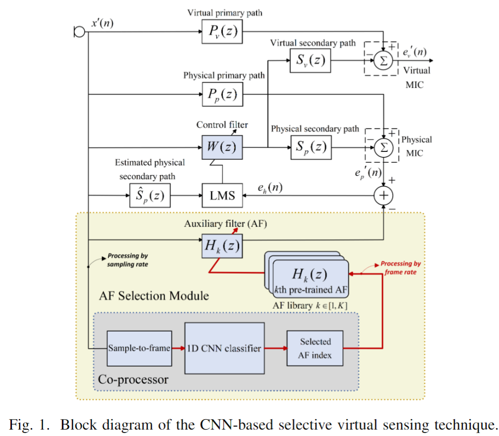
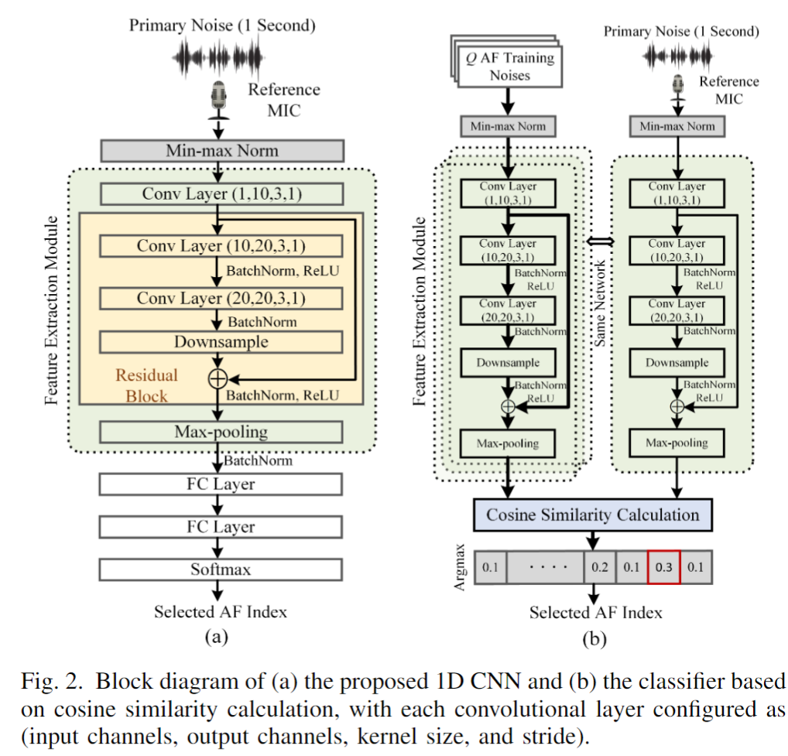

# Transferable Selective Virtual Sensing Active Noise Control

This repository contains the code associated with our paper titled "**Transferable Selective Virtual Sensing Active Noise Control Technique Based on Metric Learning**", accepted by the 2025 IEEE International Conference on Acoustics, Speech, and Signal Processing (ICASSP 2025). The paper is available on https://arxiv.org/abs/2409.05470

## Overview

Virtual sensing (VS) technology enables active noise control (ANC) systems to attenuate noise at virtual locations distant from the physical error microphones. Appropriate auxiliary filters (AF) can significantly enhance the effectiveness of VS approaches. The selection of appropriate AF for various types of noise can be automatically achieved using convolutional neural networks (CNNs). However, training the CNN model for different ANC systems is often labour-intensive and time-consuming. To tackle this problem, we propose a novel method, Transferable Selective VS, by integrating metric-learning technology into CNN-based VS approaches. The Transferable Selective VS method allows a pre-trained CNN to be applied directly to new ANC systems without requiring retraining, and it can handle unseen noise types. Numerical simulations demonstrate the effectiveness of the proposed method in attenuating sudden-varying broadband noises and real-world noises.

  
  

## User Guide
The trained network for system 1 is saved as **CNN.pth**. You can run the **Testing_system_2.ipynb** to test its classification accuracy in system 2.
The **Control_filter_ID_prediction.ipynb** is used to predict the control filter ID for the sudden-varying broadband noise. 
The *BPFs_sys1.mat* stores the bandpass filter for system 2 and the *BPFs.mat* stores the bandpass filter for system 2 

## Contact
Should you have any inquiries or require further information, please feel free to reach out via boxiang001@e.ntu.edu.sg.
